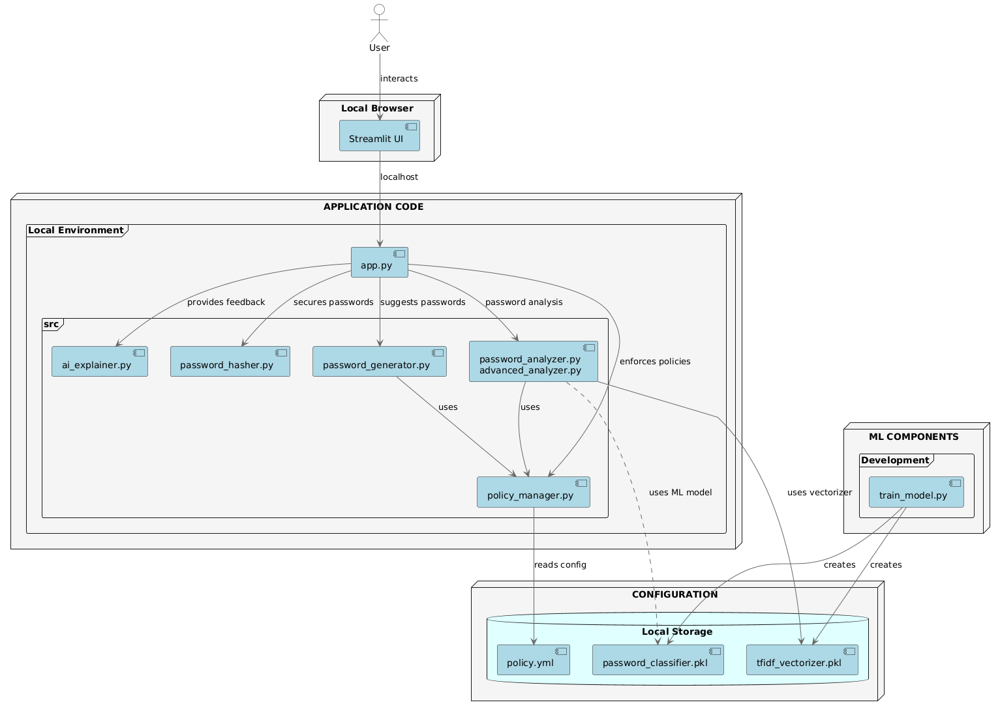
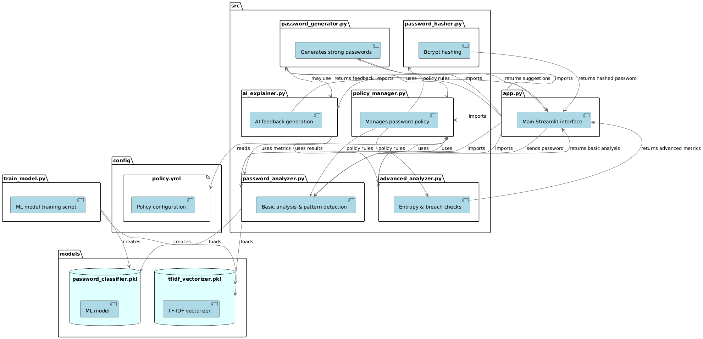
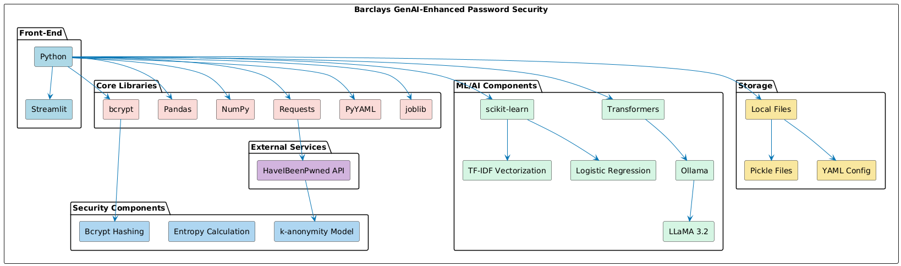

# 🔒 Barclays GenAI-Enhanced Password Generator

A comprehensive password security solution that combines traditional policy checks with AI-powered analysis, feedback, and secure password generation. This application helps users create strong passwords that meet security requirements while providing detailed insights into password vulnerabilities.

## Overview

This Streamlit-based application provides a robust password security solution that:

- Analyzes passwords against security policy requirements
- Detects common patterns and vulnerabilities
- Calculates entropy and estimated crack times
- Checks if passwords have appeared in data breaches
- Generates AI-powered security feedback
- Suggests strong policy-compliant passwords
- Uses bcrypt for secure password hashing

## Features

### Password Analysis

- **Policy Compliance Check**: Verifies passwords against configurable security requirements
- **Pattern Detection**: Identifies common patterns that weaken passwords
- **Machine Learning Analysis**: Uses a trained classifier to predict password strength
- **Breach Detection**: Checks if passwords appear in known data breaches via the HaveIBeenPwned API
- **Entropy Calculation**: Measures password randomness and estimates crack times

### AI-Enhanced Features

- **AI-Powered Feedback**: Generates natural language explanations of password weaknesses
- **Smart Password Suggestions**: Creates diverse, policy-compliant password options
- **Contextual Security Metrics**: Provides comprehensive security assessments

### Security

- **Secure Password Hashing**: Uses industry-standard bcrypt algorithm
- **Policy Customization**: Allows configuring security requirements via YAML

## Technical Architecture

The application follows a modular design with several specialized components:

### Components

#### Web Interface (`app.py`)

The main Streamlit application that provides the user interface and coordinates the various components. It handles:

- Password input and analysis request processing
- Display of security metrics and feedback
- Visualization of password strength assessments
- Suggestion selection and confirmation flow

#### Policy Management (`src/policy_manager.py`)

Manages password policy requirements loaded from the YAML configuration file. It provides:

- Policy loading and validation
- Access to policy parameters
- Special character handling for regex operations

#### Password Analysis Components

- **Basic Analyzer** (`src/password_analyzer.py`): Performs policy checks and pattern detection including:
  - Policy compliance verification
  - Common pattern recognition
  - Dictionary word detection
  - Machine learning-based strength prediction
- **Advanced Analyzer** (`src/advanced_analyzer.py`): Provides sophisticated security metrics:
  - Shannon entropy calculation
  - Crack time estimation across different attack scenarios
  - Data breach checking via HaveIBeenPwned API
  - Policy compliance for advanced requirements

#### AI-Powered Components

- **AI Explainer** (`src/ai_explainer.py`): Generates natural language feedback using local Ollama models:
  - Security assessment summaries
  - Weakness identification
  - Improvement recommendations
  - Uses the llama3.2 model by default
- **Password Generator** (`src/password_generator.py`): Creates strong password suggestions:
  - Policy-compliant random passwords
  - Enhanced versions of user passwords
  - Personalized suggestions with varying complexity
  - L33tspeak transformations

#### Security Component

- **Password Hasher** (`src/password_hasher.py`): Implements secure password handling:
  - Bcrypt hashing with configurable work factor
  - Password verification
  - Secure reset token generation

## Installation

### Prerequisites

- Python 3.8+
- Access to the internet (for breach checking API)
- (Optional) GPU for better performance with transformer models

### Setup

1. Clone the repository:

   ```bash
   git clone https://github.com/thakare-om03/password-generator-barclays.git
   cd password-generator-barclays
   git checkout om
   ```

2. Install dependencies:

   ```bash
   pip install -r requirements.txt
   ```

   Required packages include:

   ```
   streamlit
   bcrypt
   scikit-learn
   transformers
   pandas
   numpy
   joblib
   requests
   PyYAML
   tqdm
   ```

3. (Optional) Place a password dataset in the data directory:

   ```bash
   # Download a password dataset like rockyou.txt
   # Warning: Contains real breached passwords, handle securely
   mkdir -p data
   # Place rockyou.txt in the data directory
   ```

4. (Optional) Train the ML model:
   ```bash
   python train_model.py
   ```

## Detailed Usage Guide

1. Start the Streamlit application:

   ```bash
   streamlit run app.py
   ```

2. Open your web browser and navigate to the URL shown in your terminal (typically http://localhost:8501)

3. Use the application:
   - **Enter a password to analyze**: Input your password and click "Analyze"
   - **Review security analysis**: Examine policy compliance, pattern detection, entropy, and ML predictions
   - **Explore AI-generated feedback**: Read AI-powered explanations of password strengths and weaknesses
   - **Choose from suggested passwords**: Select a strong password suggestion if desired
   - **Confirm and set your password**: Finalize your password choice

### Analysis Features

The password analysis provides multiple security perspectives:

1. **Basic Security Checks**:

   - Length verification
   - Character type requirements (uppercase, lowercase, digits, special)
   - Common pattern detection

2. **Advanced Security Metrics**:

   - Entropy calculation
   - Breach status via HaveIBeenPwned
   - Crack time estimates for different attack scenarios

3. **Machine Learning Analysis**:
   - Strength score prediction using TF-IDF and logistic regression
   - Visual strength indicator

### Password Suggestions

The application generates several types of password suggestions:

1. **AI-Enhanced**: Intelligently improved version of your password
2. **Personalized**: Varying levels of enhancement to your original password
3. **High-Entropy**: Complex and random passwords
4. **Transformed**: Passwords with strategic character substitutions

## Application Screenshots

### Architecture Diagram


_System architecture with Streamlit UI, core application modules, machine learning components, and local storage configuration._



### Tech Stack



## Directory Structure

```
└── password-generator-barclays/
    ├── README.md                  # This documentation
    ├── app.py                     # Main Streamlit application
    ├── requirements.txt           # Python dependencies
    ├── train_model.py             # Script to train the ML model
    ├── config/
    │   └── policy.yml             # Password policy configuration
    ├── data/
    │   └── rockyou.txt            # Password dataset (not included)
    ├── models/
    │   ├── password_classifier.pkl # Trained ML model
    │   └── tfidf_vectorizer.pkl   # TF-IDF vectorizer
    └── src/
        ├── advanced_analyzer.py   # Advanced security metrics
        ├── ai_explainer.py        # AI-powered feedback generation
        ├── password_analyzer.py   # Basic password analysis
        ├── password_generator.py  # Password suggestion generation
        ├── password_hasher.py     # Secure password hashing
        └── policy_manager.py      # Policy loading and management
```

## Customizing Password Policy

The password policy can be customized by editing the `config/policy.yml` file:

```yaml
password_policy:
  min_length: 12 # Minimum password length
  require_upper: true # Require uppercase letters
  require_lower: true # Require lowercase letters
  require_digits: true # Require numbers
  require_special: true # Require special characters
  max_breach_count: 0 # Maximum allowed breach occurrences
  min_entropy: 60 # Minimum required entropy (bits)
  special_chars: '!@#$%^&*(),.?":{}|<>' # Allowed special characters
```

The default policy requires passwords to:

- Be at least 12 characters long
- Contain uppercase and lowercase letters
- Include at least one digit and one special character
- Have a minimum entropy of 60 bits
- Not appear in any known data breaches

## Training the ML Model

The application uses a machine learning model to predict password strength. To train or retrain the model:

1. Obtain a password dataset (e.g., RockYou.txt)
2. Place the dataset in the `data/` directory
3. Run the training script:
   ```bash
   python train_model.py
   ```

The training process:

- Loads weak passwords from the dataset
- Generates strong password examples based on policy requirements
- Creates "tricky" weak passwords that might look strong
- Extracts features using TF-IDF vectorization
- Trains a Logistic Regression classifier
- Saves the model and vectorizer to the `models/` directory

The model uses character n-grams (2-5) as features to capture important password patterns and is trained with balanced class weights to handle dataset imbalance.

## Advanced Features

### Entropy Calculation

The application calculates password entropy based on character set diversity and length:

```
Entropy = Length × log₂(Character Set Size)
```

Where Character Set Size is determined by the types of characters used (lowercase, uppercase, digits, special). This provides a quantitative measure of password strength based on information theory.

### Breach Checking

The application uses the HaveIBeenPwned API's k-anonymity model to check if passwords have appeared in known data breaches:

1. The password is hashed using SHA-1
2. Only the first 5 characters of the hash are sent to the API
3. The API returns all matching hashes with those 5 characters
4. The application checks locally if the full hash is in the response

This approach ensures passwords are never sent in full to the service, preserving security.

### AI-Powered Feedback

The application uses the Ollama implementation of the llama3.2 model to analyze password characteristics and generate natural language feedback explaining:

- Overall security assessment
- Specific weaknesses identified
- Actionable recommendations for improvement

The AI model is run locally for enhanced privacy and processes only the analysis results, not the raw password.

### Password Generation Strategies

The application employs multiple strategies for password generation:

1. **Complex Random Generation**: Creates high-entropy passwords using secure random functions
2. **Enhanced User Password**: Applies L33tspeak substitutions and strategic additions to user passwords
3. **Transformed Passwords**: Starts with a base template and applies transformations
4. **AI-Enhanced**: Uses AI to intelligently modify the user's password while preserving recognizable elements

## Security Considerations

1. **Data Privacy**: This application never sends plaintext passwords to external services. Breach checking uses the k-anonymity model of the HaveIBeenPwned API.

2. **Password Storage**: Passwords are hashed using bcrypt with a secure work factor (12 by default). In a production environment, these would be sent to a backend system.

3. **Transformer Models**: The application uses Ollama for AI features, which processes data locally. The models are stored in a configurable directory (default: "F:\\Projects\\ollama_models").

4. **Demo Mode**: Some features may display sensitive information for demonstration purposes. Modify for production use.

## Development and Customization

### Adding New Pattern Detection

To add additional pattern detection rules, modify the `password_analyzer.py` file:

1. Add new pattern detection methods
2. Include new regex patterns in the `common_patterns` list
3. Update the `analyze_password` method to include your new detection

### Extending AI Capabilities

To enhance AI features:

1. Replace the default Ollama model by changing the `DEFAULT_MODEL` in `ai_explainer.py`
2. Customize prompt templates in the `generate_feedback` and `enhance_password` methods
3. Consider adding more advanced AI features by extending the `AIExplainer` class

### Adjusting Security Thresholds

To modify security thresholds:

1. Edit the `policy.yml` file to change minimum requirements
2. Adjust the `SecurityEstimator` class in `advanced_analyzer.py` to update crack time estimates
3. Modify the `PasswordGenerator` to align with new policy requirements

## Troubleshooting

### Common Issues

1. **Model Loading Errors**:

   - Ensure the ML model is trained using `train_model.py`
   - Check that the model files exist in the `models/` directory

2. **Ollama Issues**:

   - Verify Ollama is installed (https://ollama.com/)
   - Check the model path in `ai_explainer.py`
   - Consider using a different model if the default is unavailable

3. **API Connection Failures**:
   - Ensure internet connectivity for breach checking
   - Consider implementing a fallback when the API is unreachable.
